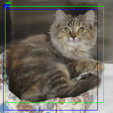
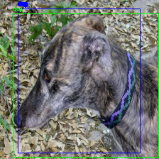

# Yolo para Detecção de gatos e cachorros
O objetivo desse projeto consiste em cria uma rede yolo para detectar cachorros e gatos em imagens. A yolo não uma CNN e sim uma FCN, ou seja, no final da rede não temos uma camada totalmente conectada mas uma camada convolucional. A saida da yolo é uma grade onde cada célula da grade contém um número espicífico de bounding boxes. O bouding boxe contém as infomações do centroide do bounding boxe (x,y) e a largura e altura do mesmo, uma posiçao que referencia a presença de um objeto chamado de objectness e a quantidade classes, possuindo essa forma (4 + 1 + quantidade de classes). Desse jeito, a saida da yolo tema seguinte forma SxSxN_bndBoxesx(4 + 1 + quantidade de classes). Para se aprofundar recomendo a leitura de https://jonathan-hui.medium.com/real-time-object-detection-with-yolo-yolov2-28b1b93e2088 e de https://medium.com/analytics-vidhya/yolo-explained-5b6f4564f31. 

## Sumário
 * Arquivos
 * Resultados
 

## Arquivos

* **annotations**: Diretórios com os rotulos das imagens.
* **images**: Diretórios com as imagens.
* **log**: Contém os resultados das funções de custo.
* **utils/preprocessing.py**: Contém as funções para padronização das imagens e extração das informações dos arquivos do rótulos.
* **utils/generator.py**: Contém as funções para o calculo de ancoras e IoU.
* **Organização.ipynb**: Criar as pastas de imagens e rotulos.
* **yolo.ipynb**: Notebook que tem o passo a passo da yolo usada no projeto.

## Resultados

A metrica para avaliação do modelo foi o IoU. O melhor resultado alcançado foi de 65,85% de IoU. As imagens abaixo traz um exemplo dos resultados:

Em verde traz o bounding boxe verdadeiro e em azul a previsão da rede.

